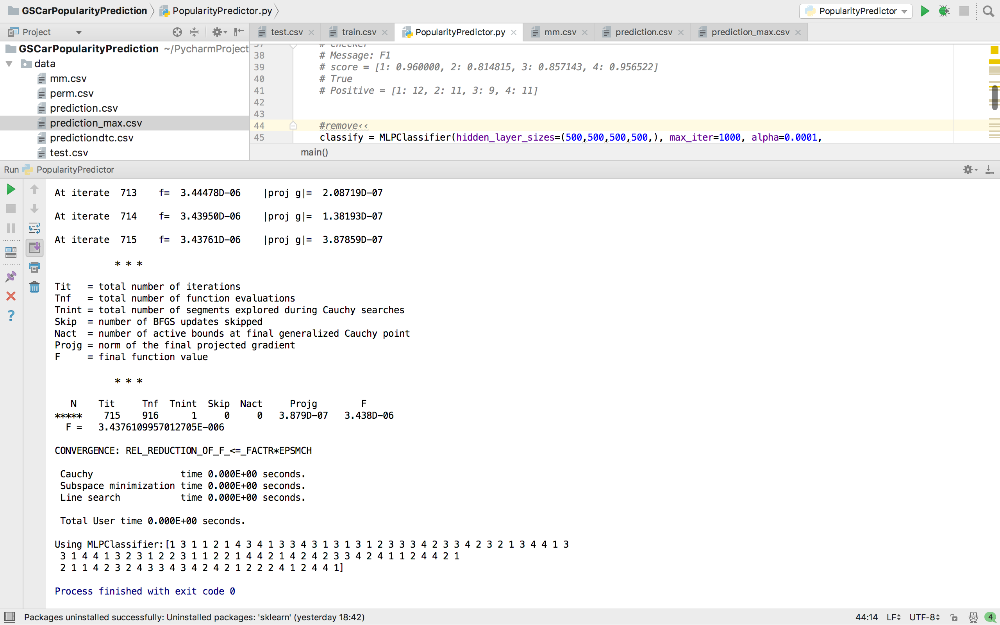

# CarPopularityPrediction

This Project Classifies a Cars Popularity based on 6 parameters:

### buying_price
### maintainence_cost
### number_of_doors
### number_of_seats
### luggage_boot_size
### safety_rating

Using Scikit-Learn I was able to achieve an optimal F_score for the training data by using the solver lbfgs as
compared to Decision Tree Classifiers' result which is confused for classes 2 and 3 :

### MLPClassifier
### Decision Tree Classifier

MLPClassifier(hidden_layer_sizes=(500,500,500,500,), max_iter=1000, alpha=0.0001,
                     solver='lbfgs', verbose=10,  random_state=120, tol=0.000000001,
                      warm_start=True, learning_rate_init=0.05 )

MLPClassifier's lbfgs solver converges faster and is more suitable for this dataset. lbfgs is an optimizer in the family of quasi-Newton methods.

### Test
Simply run PopularityPredictor.py

